# 💊 Medical Assistant – RAG + Agentic AI (Streamlit + FastAPI + Supabase)


<!-- Project Info Badges -->


An end-to-end medical assistant that combines **RAG Q\&A**, **agentic workflows** (registration, appointment, medicines, summaries), and an **admin dashboard**.
Frontend in **Streamlit**, backend in **FastAPI**, persistence with **SQLite/Supabase**, and embeddings via **SentenceTransformers** (offline compatible).
This Project is real time project in which real time registration of patients, appointment confirmation, medicine stock status and patient case summaries can be seen.

## [Deployed Link](https://medical-agentic-ai-bot-mohit-gupta.streamlit.app/)
## [Deployed Backend Link](https://mohitg012-medical-bot-agentic-ai.hf.space)

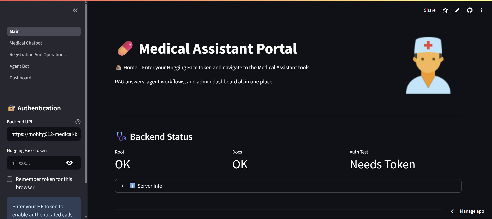

---

## ✨ Features

* **RAG Chatbot**: Ask medical questions with **citations & page numbers** from your medical book.
* **Agentic Assistant**: One prompt to **register patients**, **confirm appointments**, **check medicines**, or **summarize cases**.
* **Admin Dashboard**: Live KPIs + tables for **patients, doctors, medicines**, with CSV export.
* **HF Token Pass-Through**: Frontend collects your **Hugging Face token** and forwards it to backend per request.
* **Offline-friendly Embeddings**: Bundled `all-MiniLM-L6-v2` supports air-gapped runs.

---

## 🏗️ Architecture

```
Streamlit (Frontend)
   ├─ collects HF token (never stored on server)
   ├─ hits FastAPI endpoints
   └─ renders chat, agent results, dashboard

FastAPI (Backend)
   ├─ /query (RAG) → retriever + reader over medical_book.pdf
   ├─ /orchestrator_query (Agent) → routes to tools
   ├─ /register_patient, /check_registration_status
   ├─ /medicine_availability, /release_stale_doctors
   ├─ /summarize_case/{id}
   └─ /admin/* read APIs for dashboard

Storage
   ├─ SQLite or Supabase (patients, doctors, medicines)
   ├─ FAISS index + chunk metadata in Artifacts/
   └─ PDF and page images in Artifacts/raw_pdf & page_images

Models
   └─ SentenceTransformer: models/all-MiniLM-L6-v2
```

---

## 📁 Repository Layout (key folders)

```
Medical-Assistant/
├── 📂 Artifacts/                       # Data artifacts for RAG
│   ├── 📂 embeddings/                  # FAISS index + metadata
│   │   ├── 📄 faiss_index.bin
│   │   └── 📄 metadata.pkl
│   ├── 🖼️ images/                      # Extracted diagrams/tables
│   │   └── 🖼️ medical_book_pageXXX_imgX.jpeg
│   ├── 🖼️ page_images/                 # Page-level snapshots for citations
│   │   └── 🖼️ medical_book_pageXXX_snapshot.png
│   ├── 📂 processed_text/              # Chunked text + metadata
│   │   └── 📄 chunks_metadata.json
│   └── 📂 raw_pdf/
│       └── 📄 medical_book.pdf

├── 📂 DataBase/
│   └── 🗄️ medical_assistant.db         # Local SQLite DB (if not using Supabase)

├── 🎨 Frontend/                        # Streamlit UI
│   ├── 🐍 Main.py                      # Home page (health + nav)
│   ├── ⚙️ config.py                    # BASE_URL settings
│   ├── 📂 pages/                       # Streamlit multipage structure
│   │   ├── 🐍 1_Medical_Chatbot.py
│   │   ├── 🐍 2_Registration_And_Operations.py
│   │   ├── 🐍 3_Agent_Bot.py
│   │   └── 🐍 4_Dashboard.py
│   ├── 📄 requirements.txt             # Frontend dependencies
│   ├── 🐳 Dockerfile                   # Frontend container
│   └── 📄 .dockerignore

├── ⚙️ Src/                             # Backend (FastAPI + services)
│   ├── 📂 api/
│   │   └── 🐍 fastapi_app.py           # FastAPI entrypoint
│   ├── 📂 rag/                         # Retrieval-Augmented Generation
│   │   ├── 🐍 pdf_utils.py
│   │   ├── 🐍 preprocess.py
│   │   ├── 🐍 retriever.py
│   │   ├── 🐍 rag_pipeline.py
│   │   └── 🐍 embed_store.py
│   ├── 📂 agent/                       # Orchestrator + tools
│   │   ├── 🐍 agent_executor.py
│   │   ├── 🐍 gemma_chat_llm.py
│   │   ├── 🐍 orchestrator.py
│   │   └── 🐍 tools.py
│   ├── 📂 services/                    # Business logic (DB, doctors, patients…)
│   │   ├── 🐍 db.py
│   │   ├── 🐍 doctor_assignment.py
│   │   ├── 🐍 doctor_service.py
│   │   ├── 🐍 medicine_service.py
│   │   ├── 🐍 patient_service.py
│   │   └── 🐍 summarizer.py
│   ├── 📄 requirements.txt             # Backend dependencies
│   ├── 🐳 Dockerfile                   # Backend container
│   └── 📄 .dockerignore

├── 🤖 models/                          # Local SentenceTransformer model
│   └── 📂 all-MiniLM-L6-v2/
│       ├── 📄 model.safetensors
│       ├── 📄 config.json
│       ├── 📄 tokenizer.json
│       └── 📄 vocab.txt
│       ... (other ST files)

├── 📓 Notebooks/                       # Dev & exploration
│   ├── 📓 01_data_preprocessing.ipynb
│   ├── 📓 02_embeddings_rag.ipynb
│   └── 📓 03_rag_pipeline.ipynb

├── ⚙️ .gitignore
├── ⚙️ .dvcignore
├── ⚙️ .dockerignore
├── 🐳 docker-compose.yml               # Compose for frontend + backend
├── 🐳 dockerfile                       # (Optional) project-level Docker
├── 📄 Data.dvc                         # DVC tracking file
├── 📝 Future_steps_for_this_project.txt
├── 📘 Readme.md                        # Project documentation
└── 📄 requirements.txt                 # Global deps (if needed)

```

---

## 🎥 Demo / Screenshots

### Frontend
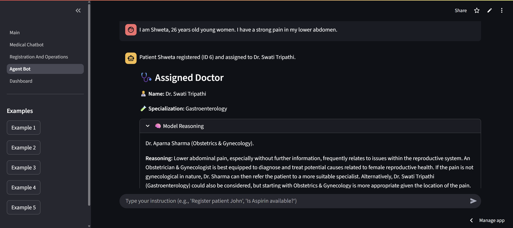
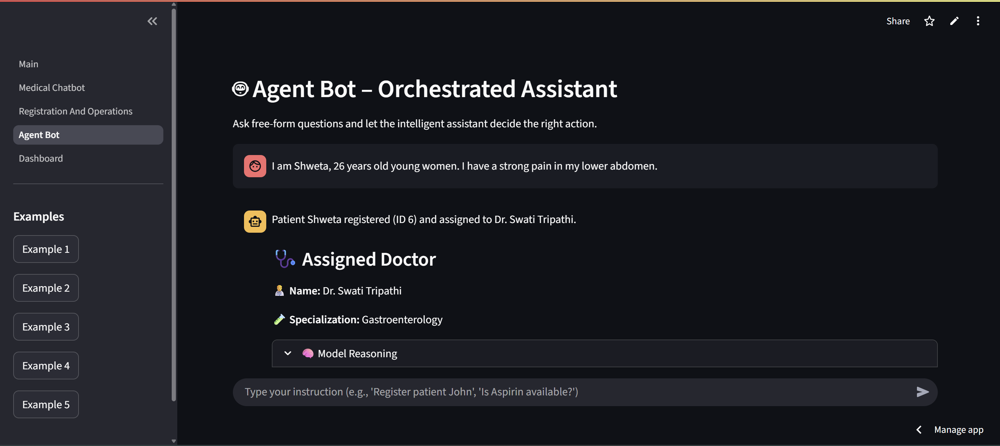
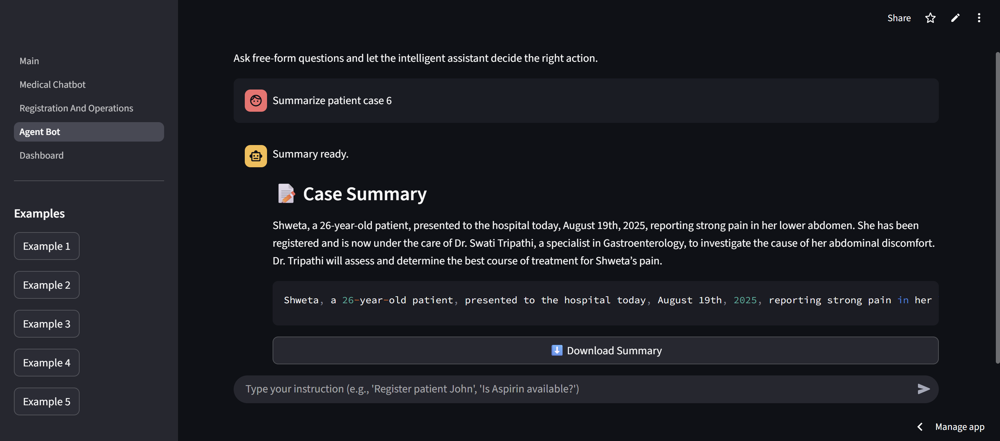
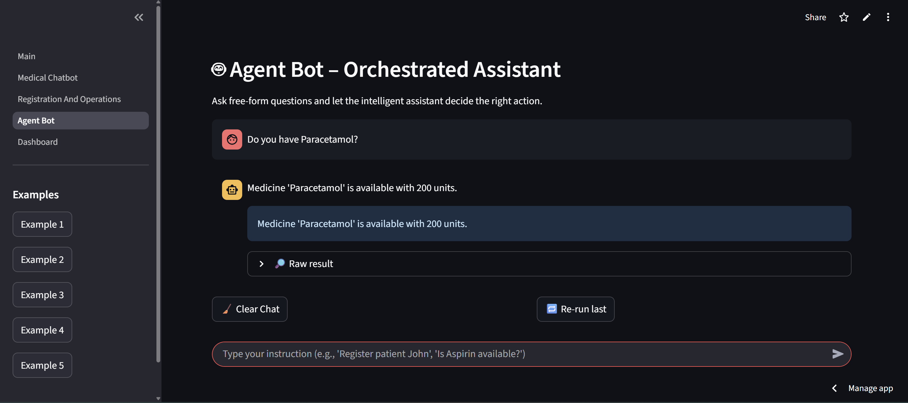

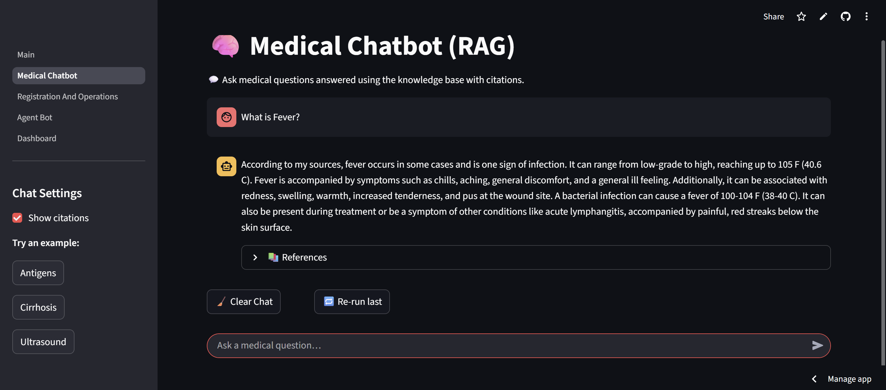
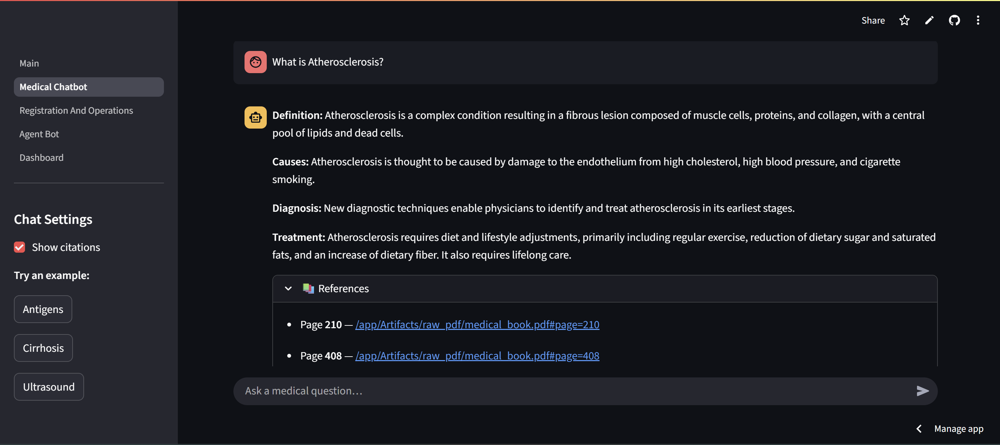

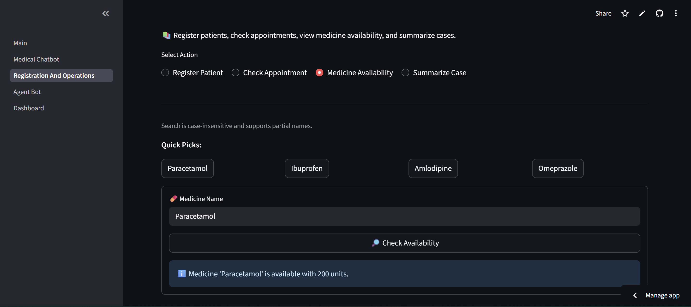
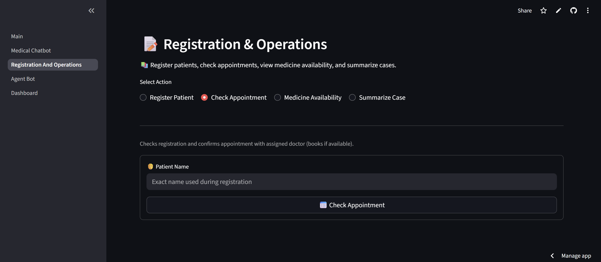

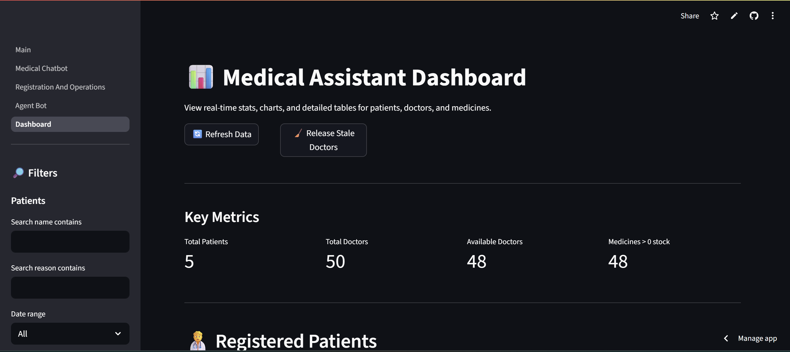
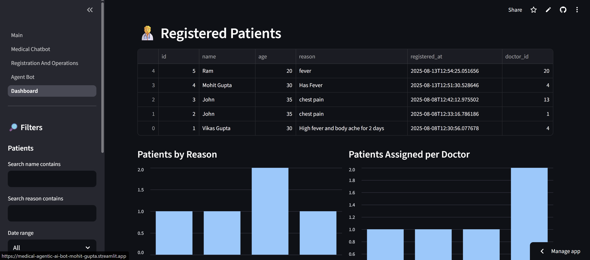
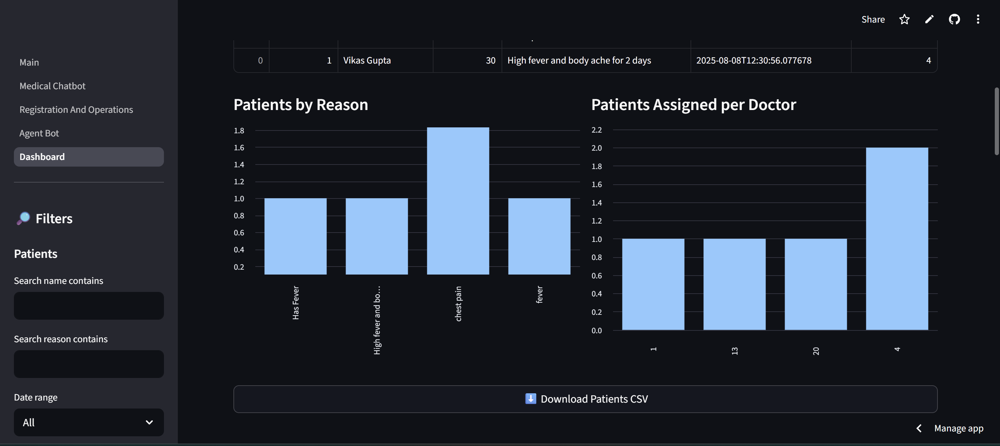
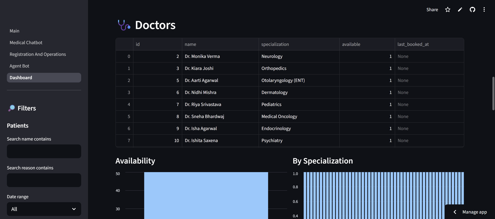
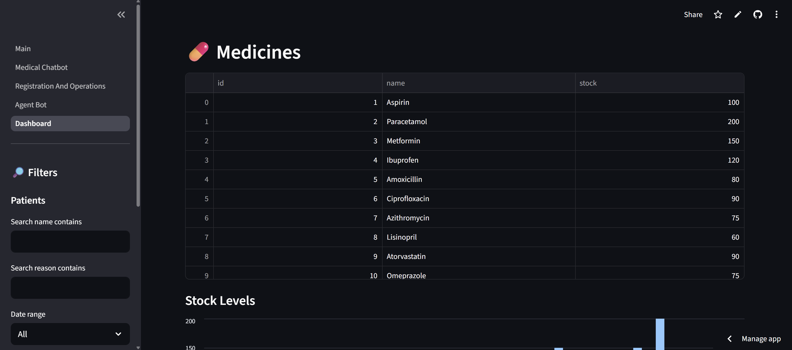
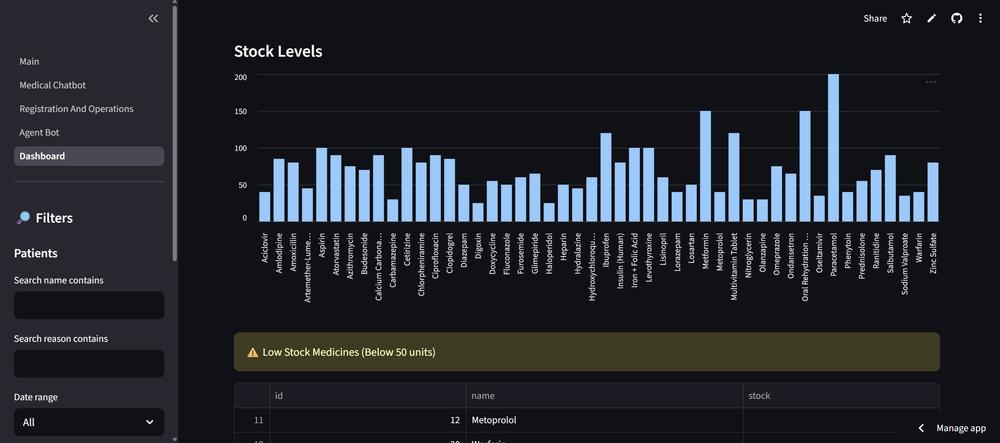

### Backend


---

## 🔌 API Endpoints (FastAPI)

* `GET /` – health/info
* `GET /docs` – Swagger UI
* `GET /query?q=...` – **RAG** answer with references
* `GET /orchestrator_query?q=...` – **Agent** router
* `POST /register_patient` – JSON: `{name, age, reason}`
* `POST /check_registration_status` – JSON: `{name}`
* `GET /medicine_availability?name=...`
* `POST /release_stale_doctors`
* `GET /summarize_case/{patient_id}`
* `GET /admin/patients` | `/admin/doctors` | `/admin/medicines`

**Auth:** Frontend forwards `Authorization: Bearer <HF_TOKEN>` to backend for any HF-model calls.

---

## ⚙️ Prerequisites

* Python 3.10+
* (Optional) Docker / docker-compose
* (Optional) Supabase credentials
* A Hugging Face token with access to models you call **from the backend**

---

## 🚀 Quickstart (Local, 2 terminals)

### 1) Backend (FastAPI)

```bash
cd Src
python -m venv .venv && source .venv/bin/activate    # (Windows: .venv\Scripts\activate)
pip install -r requirements.txt

# ENV (see “Environment Variables” below)
export SUPABASE_URL=...          # optional
export SUPABASE_KEY=...          # optional
export HF_API_TIMEOUT=60         # optional

uvicorn api.fastapi_app:app --host 0.0.0.0 --port 8000 --reload
```

### 2) Frontend (Streamlit)

```bash
cd Frontend
python -m venv .venv && source .venv/bin/activate
pip install -r requirements.txt

# Point frontend to backend:
export BASE_URL="http://localhost:8000"

streamlit run Main.py
```

Open [http://localhost:8501](http://localhost:8501) → **enter your HF token** in the sidebar → use the **Navigation** buttons.

---

## 🌐 Deployment Options

### A) Docker Compose (Frontend + Backend)

```bash
docker compose up --build
```

Browse [http://localhost:8501](http://localhost:8501).

### B) Hugging Face Spaces (Docker)

* **Backend Space** → type: Docker; `Src/Dockerfile` as root.
* **Frontend Space** → type: Docker; `Frontend/Dockerfile` as root.
* Set **CORS** in FastAPI to allow the frontend origin.
* In the **frontend UI**, set **Backend URL** to your backend Space URL.
* Enter your **HF token** in the frontend sidebar.

---

## 🔑 Environment Variables

Backend (FastAPI):

* `SUPABASE_URL` *(optional)* – use Supabase instead of SQLite
* `SUPABASE_KEY` *(optional)* – service key/token
* `HF_API_TIMEOUT` *(optional, default=60)* – timeout for HF calls
* (Project-specific) any model name/endpoint your tools require

Frontend (Streamlit):

* `BASE_URL` – **FastAPI URL** (e.g., `http://localhost:8000` or your HF Space URL)

**HF Token** is **not** stored as an env—users paste it in the sidebar; the app forwards it per request.

**.env example**:

```
# Backend
SUPABASE_URL=https://xyzcompany.supabase.co
SUPABASE_KEY=your-service-role-key
HF_API_TIMEOUT=60

# Frontend
BASE_URL=http://localhost:8000
```

---

## 📚 Data & Artifacts

* `Artifacts/raw_pdf/medical_book.pdf` – source
* `Artifacts/processed_text/chunks_metadata.json` – chunk map
* `Artifacts/embeddings/faiss_index.bin` – FAISS index
* `Artifacts/page_images/*.png` – page snapshots for citations
* `Artifacts/images/*` – extracted diagrams/tables

Use the included notebooks in `Notebooks/` to (re)build chunks and embeddings:

* `01_data_preprocessing.ipynb`
* `02_embeddings_rag.ipynb`
* `03_rag_pipeline.ipynb`

---

## 🧠 RAG Pipeline (high-level)

1. **Preprocessing**: split PDF into pages → OCR/parse → chunk text (windowing + overlap).
2. **Embedding**: `all-MiniLM-L6-v2` (bundled) → FAISS index + metadata.
3. **Retrieval**: semantic search top-k + re-rank; attach page links.
4. **Generation**: LLM forms answer, citing source pages.

---

## 🤖 Agent Orchestrator

* **Input** → intent classification → tool routing:

  * `register_patient` → doctor assignment (Gemma-powered reasoning)
  * `check_registration_status` / `confirm_appointment`
  * `medicine_availability`
  * `summarize_case`
  * RAG fallback for open questions
* Returns **typed payloads** that the frontend renders nicely (cards, expanders, downloads).

---

## 🖥️ Frontend Pages

* **Home**: health checks (`/`, `/docs`, small auth ping), quick actions, navigation.
* **Medical Chatbot**: chat UI with optional **References** (page & link).
* **Registration & Operations**: forms for **register**, **appointment**, **medicines**, **summary**.
* **Dashboard**: KPIs, charts, searchable tables, CSV downloads, **Release stale doctors**.

---

## 🧪 Smoke Tests

After starting both services:

* `GET {BASE_URL}/` → returns server info JSON
* `GET {BASE_URL}/docs` → OpenAPI UI
* RAG test from **Home → “Run sample RAG”**
* Agent tests from **Agent Bot** sidebar examples
* **Dashboard** loads counts and tables

---

## 🔐 Security Notes

* HF token is **only kept in Streamlit `session_state`** (per browser session).

---

## 🛠️ Troubleshooting

* **Home → Backend Status**

  * **Root/Docs down** → backend not reachable; check `BASE_URL`, ports, CORS.
  * **Auth Test failed** → invalid/missing HF token; backend rejecting `Authorization` header; or model not accessible.
* **Dashboard empty** → ensure `/admin/*` endpoints return arrays under `items` or raw arrays.
* **Summarize case “No summary”** → check patient id exists; inspect backend logs.
* **Embeddings mismatch** → rebuild FAISS with `Notebooks/02_embeddings_rag.ipynb`.

---

## 🛣️ Roadmap (Future\_steps\_for\_this\_project.txt hooks)

* Multi-book/corpus support with collection switcher
* Per-user chat history + consented analytics
* Doctor scheduling calendar with slots
* Evaluations: retrieval metrics & answer grading set

---

## 🙏 Acknowledgements

* SentenceTransformers `all-MiniLM-L6-v2`
* FastAPI, Streamlit, FAISS
* (Optional) Supabase

---

## 👨‍💻 Repo Owner

👤 **Mohit Gupta**

🎓 [mgmohit1111@gmail.com](mailto:mgmohit1111@gmail.com)

🔗 [LinkedIn](https://linkedin.com/in/mohitgupta012) | [GitHub](https://github.com/MohitGupta0123)
